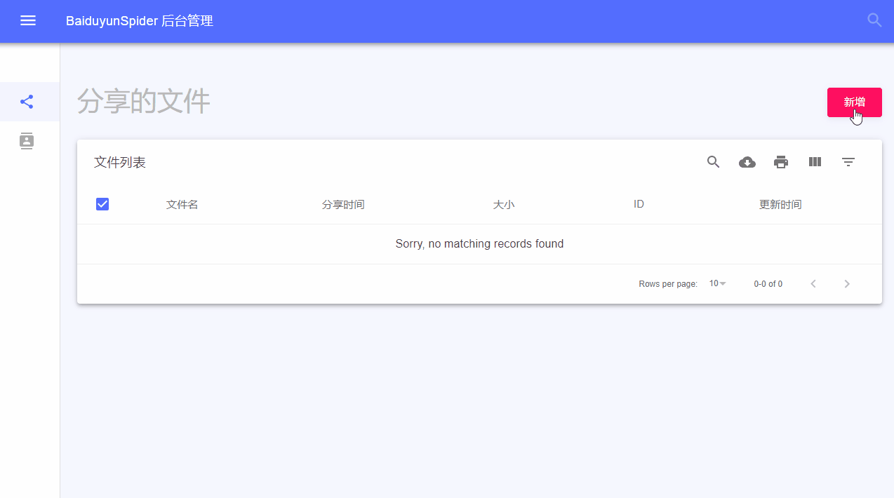

# BaiduyunSpider
分布式百度网盘爬虫，使用当前最流行的技术框架。适合个人学习以及二次开发。

爬虫基于 `Scrapy`，灵活简单、易扩展，方便二次开发。使用 `Scrapy-Redis` 作为分布式中间件，可同时部署多个爬虫实例，以提升采集效率。`Web`后台管理基于`React`，`Material Design` 设计风格。 


## 依赖 
- MongoDB
- Python3
- Redis
- Node.js > 8.0 (可选) 

## 安装 

```
pip install -r requirements.txt
```

## 如何使用 

1.运行爬虫 

```
scrapy crawl baidupan
```

2.运行Web Service 

```
cd api
python rest.py
```

3.开始采集 

开源版目前需要通过后台管理界面，手动提交待采集的分享链接。或者使用`API`方式：

```
POST http://localhost:5000/addUrl
表单参数: url
```

curl 例子

```
curl -X POST http://localhost:5000/addUrl \
  -F url=https://pan.baidu.com/s/17BtXyO-i02gsC7h4QsKexg
```


## 运行截图

爬虫运行截图 


后台管理界面 



## 技术支持
提供高级版本，包含额外的搜索引擎和私密分享采集部分，暂仅用于毕业设计。联系邮箱：