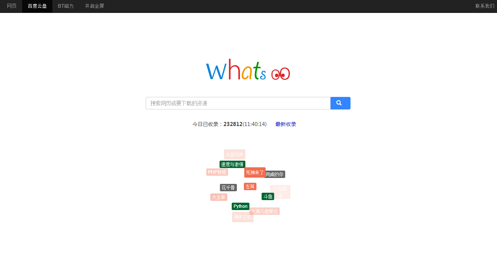

# BaiduyunSpider
包含百度云网盘爬虫、网站前后端、搜索，整套服务。http://www.githubs.cn/project/16085

## 技术栈

* 网站： PHP  Codeigniter 
* 爬虫：Python
* 搜索引擎：Xunsearch
* 数据库：MySql

## 演示站点

* [爱百应搜索](http://pan.ibying.com)

## 附言

这套程序是我大二练手，初学Python写的，一直放在哪儿都要发霉了，现拿来和大家一起共享。代码有些丑，一直没时间维护，很多不足之处望指教。如果关注，感兴趣的人比较多，准备抽时间重构下

>  另外本人现在大四，17年毕业，熟悉前后端开发，__求一份JAVA后台开发工作__
>
>  有阿里巴巴4个月实习经验，联系邮箱：k19#95328@gm#ail.com

__TODO__

- [ ] 分布式爬虫
- [ ] 爬虫IP代理
- [ ] Web 控制面板
- [ ] 死链检测

近期__TODO__
- [ ] 重构爬虫 => 采用Node.js
- [ ] 使用 elasticsearch 搜索引擎

## 讨论交流

有任何疑问，请在 [github 中文社区](http://www.githubs.cn/topic/118) 发帖。

[安装教程](http://www.githubs.cn/post/22)

## License

GPL